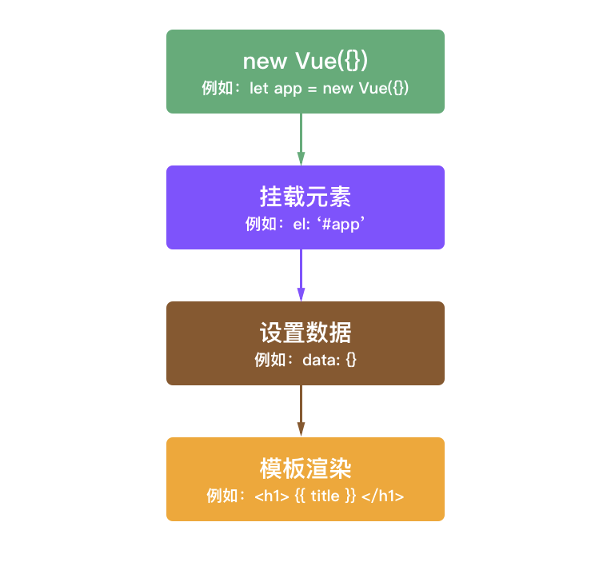

## 什么是Vue？


Vue (读音 /vjuː/，类似于 **view**) 是一套用于构建用户界面的**渐进式框架**。

与其它大型框架不同的是，Vue 被设计为可以**自底向上逐层应用**。

Vue 的核心库**只关注视图层**，不仅易于上手，还便于与第三方库或既有项目整合。

另一方面，当与[现代化的工具链](https://cn.vuejs.org/v2/guide/single-file-components.html)以及各种[支持类库](https://github.com/vuejs/awesome-vue#libraries--plugins)结合使用时，Vue 也完全能够为复杂的单页应用提供驱动。


Vue.js是当下很火的一个**JavaScript MVVM库**，它是以**数据驱动和组件化**的思想构建的

[对比其他框架](https://cn.vuejs.org/v2/guide/comparison.html)


## 起步


引用Vue，可以在官网中使用引用链接：

```javascript

```

或者

```javascript
<!-- 生产环境版本，优化了尺寸和速度 -->
<script src="https://cdn.jsdelivr.net/npm/vue"></script>
```


同时也可以把vue下载到本地进行引入

[开发版](https://vuejs.org/js/vue.js)——包含完整的警告和调试模式

[生产版](https://vuejs.org/js/vue.min.js)——删除了警告，30.96KB min+gzip


也可以在Vue构建大型应用时使用npm安装。

官方推荐在构建项目时使用此方法安装，NPM 能很好地和诸如 [webpack](https://webpack.js.org/) 或 [Browserify](http://browserify.org/) 模块打包器配合使用。同时 Vue 也提供配套工具来开发[单文件组件](https://cn.vuejs.org/v2/guide/single-file-components.html)。

```shell
npm install vue
```


## 声明式渲染


Vue.js 的核心是一个允许采用简洁的模板语法来声明式地将数据渲染进 DOM 的系统： 

```html
<div id="app">
  {{ message }}
</div>
```


```javascript
var app = new Vue({
  el: '#app',
  data: {
    message: 'Hello Vue!'
  }
})
```


我们已经创建了第一个Vue应用！！

在Vue中所有的东西都是**响应式**的。


- `new Vue()`是我们构造的一个Vue实例。

- `el:`为作用域，告知该Vue实例作用在哪个位置。

- `data:`为数据，里面定义动态数据的变量。


在Vue中创建一个Vue实例，大致会经历四个过程：




使用Vue的过程就是定义MVVM各个组成部分的过程的过程。

1. **定义View**
2. **定义Model**
3. **创建一个Vue实例或"ViewModel"，它用于连接View和Model**

在创建Vue实例时，需要传入一个**选项对象**，选项对象可以包含数据、挂载元素、方法、模生命周期钩子等等。


