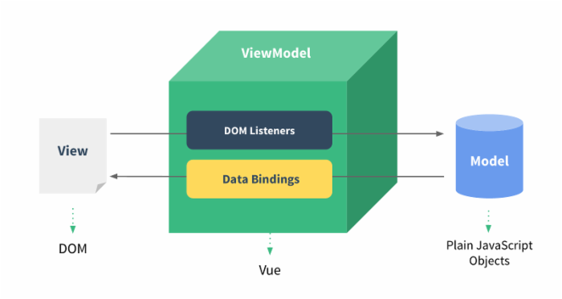

## v-model


`v-model`指令：绑定数据源

用于把数据绑定在特定的表单元素上

实现**双向数据绑定**


双向数据绑定：即当数据发生变化的时候，视图也就发生变化，当视图发生变化的时候，数据也会跟着同步变化。




#### 举个栗子

```html
<div id="app">
	<input type="text" v-model="name">
    <p v-text="name"></p>
</div>
```


```javascript
const app = new Vue({
    el: "#app",
    data: {
        name: "Tangerine",
    }
})
```


此时我们的`input`标签已经与构造器关联，当改变`input`标签中内容时，同时也改变name的变量值。


#### 修饰符


`v-model`有几个修饰符，用于附加处理数据

- `.lazy` 懒加载，当input标签失去焦点时才会触发加载
- `.number`将输入的字符串转为数字
- `.trim`输入去掉首尾空格


如何使用呢？

```html
<input type="text" v-model.lazy="name">
<input type="text" v-model.number="age">
<input type="text" v-model.trim="nick_name">
```


#### 单选框双向绑定

```html
<input type="radio" id="man" v-model="gender" value="男">
<label for="man">男</label>
<input type="radio" id="woman" v-model="gender" value="女">
<label for="woman">女</label>
<p>{{gender}}</p>
```


#### 多选框双向绑定

```html
<input type="checkbox" v-model="hobby" id="books" value="看书">
<label for="books">看书</label>
<input type="checkbox" v-model="hobby" id="movie" value="看电影">
<label for="movie">看电影</label>
<input type="checkbox" v-model="hobby" id="basketball" value="打篮球">
<label for="basketball">打篮球</label>
<p>{{hobby}}</p>
```


hobby为数组


#### 文本域双向绑定

```html
<textarea cols="30" rows="10" v-model="message"></textarea>
```


