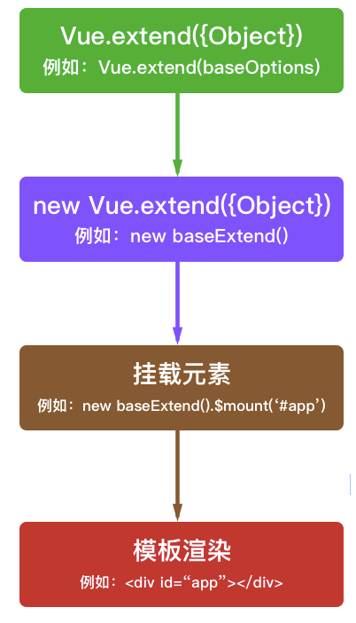

## Vue.extend()


`Vue.extend()`返回的时一个“扩展示例构造器”，也就是预设了部分选项的Vue示例构造器。

常服务于`Vue.component()`用来生成组件


使用基础 Vue 构造器，创建一个“子类”。参数是一个包含组件选项的对象。


简单理解为当在模板中遇到该组件名称作为标签的自定义元素时，会自动调用扩展实例构造器来生产组件实例，并挂载到自定义元素上。



#### 

#### 

#### 举个栗子


```html
<div id="mount-point"></div>
```


```javascript
// 创建构造器
var Profile = Vue.extend({
    // 在构造器中构造一个模板
  	template: '<p>{{firstName}} {{lastName}} aka {{alias}}</p>',
  	data: function () {
        return {
      		firstName: 'Walter',
      		lastName: 'White',
      		alias: 'Heisenberg'
    	}
  	}
})
// 创建 Profile 实例，并挂载到一个元素上。
new Profile().$mount('#mount-point')
```


extend可以挂载到一个定义好的标签中，也可以自定义标签来实现需求


在 `Vue.extend()` 中它**必须是函数**


