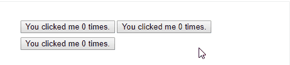
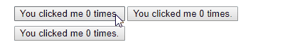

## Component组件


**组件是Vue学习的重点！**

**组件是Vue学习的重点！**

**组件是Vue学习的重点！**


重要的事情说三遍


组件就是制作自定义的标签，这些标签在HTML中是没有的。

真实项目中每天都在编写组件和使用组件。


#### 定义全局组件

```javascript
Vue.component('my-component-name', { /* ... */ })
```


`Vue.component` 为组件名。

官方推荐两种组件名的命名方式：`PascalCase`和 `kebab-case`


全局组件可以在任何作用域中调用，不过也要放在作用域中才能生效。


这里有一个官方的Vue组件实例：

```javascript
// 定义一个名为 button-counter 的新组件
Vue.component('button-counter', {
  data: function () {
    return {
      count: 0
    }
  },
  template: '<button v-on:click="count++">You clicked me {{ count }} times.</button>'
})
```


组件是**可复用的Vue实例**，且带有一个名字：在这个例子中是 `<button-counter>`。

我们可以在一个通过 `new Vue` 创建的 Vue 根实例中，把这个组件作为自定义元素来使用：

```html
<div id="components-demo">
  <button-counter></button-counter>
</div>
```

```javascript
new Vue({ el: '#components-demo' })
```





因为组件是可复用的 Vue 实例，

所以它们与 `new Vue` 接收相同的选项，例如 `data`、`computed`、`watch`、`methods` 以及生命周期钩子等。

仅有的例外是像 `el` 这样根实例特有的选项。


#### data必须是一个函数


当我们定义一个组件时，它的`data`选项并不像以前一样直接提供一个对象，而是，**一个组件的 data 选项必须是一个函数**。因此每个实例可以维护一份被返回对象的独立的拷贝：

```javascript
data: function () {
  return {
    count: 0
  }
}
```


如果Vue没有这条规则，有些实例可能会出现我们不想出现的联动影响




#### 定义局部组件


局部组件仅可以在指定作用域中调用，其他作用域调用无效


```html
<div id="app">
    <panda></panda>
</div>
<script type="text/javascript">
    var app=new Vue({
        el:'#app',
        components:{
            "panda":{
                template:`<div style="color:red;">局部注册的panda标签</div>`
            }
        }
    })
</script>
```


局部注册其实就是写在构造器里，需要注意的是，**构造器里的`components`是加s的，而全局注册是不加s的**。


#### 组件与指令的区别


指令定义的是标签属性，注册的是已有标签的属性

组件定义的是标签，注册的是一个新的标签

其功能各有所长。


## Prop


props选项设置和获取标签上的属性值，

prop是我们可以在组件上注册的一些自定义特性。

当一个值传递给一个prop特性的时候，它就变成了那个组件实例的一个属性。

**通过prop向子组件传递数据。**


#### 举个栗子

```html
<body>
    <div id="app">
      <panda here="China"></panda>
    </div>
    
    <script type="text/javascript">
        var app=new Vue({
            el:'#app',
            components:{
                "panda":{
                    template:`<div style="color:red;">Panda from {{ here }}.</div>`,
                    props:['here']
                }
            }
        })
    </script>
</body>
```


`props`选项把`panda`标签中`here`属性值取出，并赋值到模板`template`所对应的变量中。


> 注意：
>
> HTML 中的特性名是大小写不敏感的，所以浏览器会把所有大写字符解释为小写字符。这意味着当你使用 DOM 中的模板时，camelCase (驼峰命名法) 的 prop 名需要使用其等价的 kebab-case (短横线分隔命名) 命名
>
> ```javascript
> Vue.component('blog-post', {
> // 在 JavaScript 中是 camelCase 的
> props: ['postTitle'],
> template: '<h3>{{ postTitle }}</h3>'
> })
> ```
> ```html
> <!-- 在 HTML 中是 kebab-case 的 -->
> <blog-post post-title="hello!"></blog-post>
> ```
> 重申一次，如果你使用字符串模板，那么这个限制就不存在了
> 


#### 在构造器里向组件中传值


把构造器中data的值传递给组件，我们只要进行绑定就可以了。

就是使用`v-bind:xxx="data值"`或简写`:xxx="data值"`。


```html
<panda v-bind:here="message"></panda>
```

```javascript
 var app=new Vue({
     el:'#app',
     data:{
         message:'SiChuan' 
     },
     components:{
         "panda":{
             template:`<div style="color:red;">Panda from {{ here }}.</div>`,
             props:['here']
         }
     }
 })
```


